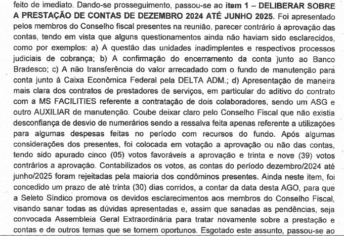

# CCRRC - Reunião do Conselho Fiscal

### Assuntos abordados em 25/08/2025 pelos membros:

- Deodoro
- José Motta
- Gil Eder

# Parecer do Conselho Fiscal

Em função do não cumprimento da [convenção](https://github.com/recreiocanoas/cf/blob/main/convencao.pdf), o Conselho Fiscal (CF) do Condomínio Residencial Recreio das Canoas (CRRC) recomendou após a [reunião de 25 de julho](https://github.com/recreiocanoas/cf/blob/main/2025.07.22.cf.reuniao.md) a NÃO APROVAÇÃO das contas da administração na Assembléia Geral Ordinária de julho de 2025. Segue abaixo reprodução do trecho da [ata da última AGO](https://github.com/recreiocanoas/cf/blob/main/2025.07.26.ago.ata.pdf), realizada em 26 de julho no salão da sede do condomínio.

## Solicitações do CF não atendidas pelo síndico

Os arquivos estão publicados em https://github.com/recreiocanoas/cf

[2025.04.12.cf.reuniao.md](https://github.com/recreiocanoas/cf/blob/main/2025.04.12.cf.reuniao.md)

- verba do Fundo de Obras deveria estar depositada na CEF;
- recomendação de não mais utilizar verba do Fundo de Obras para despesas ordinárias;
- solicitado detalhamento dos casos de inadimplência.

[2025.05.17.cf.reuniao.md](https://github.com/recreiocanoas/cf/blob/main/2025.05.17.cf.reuniao.md)

- Fundo de Obras em aplicação com melhor rendimento;
- revisão do relatório de inadimplência com advogados.

[2025.06.16.cf.reuniao.md](https://github.com/recreiocanoas/cf/blob/main/2025.06.16.cf.reuniao.md)

- relatório detalhado sobre Fundo de Obras;
- controle de inadimplência;
- encerramento da conta Bradesco;
- reclamação sobre solicitações anteriores não atendidas.

[2025.07.14.cf.reuniao.md](https://github.com/recreiocanoas/cf/blob/main/2025.07.14.cf.reuniao.md)

- reclamação sobre solicitações anteriores não atendidas.

## Casos de inadimplência

Solicitar aos advogados um relatório mais completo, incluindo a quantidade de parcelas já pagas e faltantes em cada um dos acordos. Listar quais casos sem acordo que não estariam ainda sendo reportados e quais unidades estariam passíveis de inventário. Seria ainda necessário que esses detalhes passassem a ser reportados nos livros mensais para facilitar o acompanhamento de cada caso. 

## Contratos firmados pela administração

Verificada a falta de documentos importantes na administração, incluindo o aditivo da empresa "Facilities" para acertar o quadro de profissionais contratados. Solicitamos que TODOS os contratos firmados pela administração sejam mantidos na secretaria do condomínio e disponibilizados para o CF e todos os condôminos, incluindo o contrato da empresa Selectos que não se encontra na administração.

## Previsão Orçamentária e convocação de Assembléia

Causa-nos preocupação a convocação de Assembléia Geral Ordinária do mês de julho 2025 sem que a previsão orçamentária do período que se inicia tenha sido previamente apresentada para análise e parecer do Conselho Fiscal do CRRC. Verificamos ainda que a referida precisão orçamentária relativa ao exercício em início também não foi enviada juntamente com a convocação para os condôminos, impedindo uma análise prévia e adequada por parte de todos. Solicitamos a correção deste procedimento para atender à Convenção Condominial.

## Totalização das verbas do Fundo de Obras

No Bradesco até 05/2024:        R$ 329.654,29

Arrecadação mensal:
- junho 2024:       $7.606,72
- julho 2024:      $10.445,94
- agosto 2024:      $9.812,81
- setembro 2024:    $9.408,09
- outubro 2024:     $9.621,93
- novembro 2024:    $9.450,00
- dezembro 2024:   $10.150,00
- janeiro 2025:     $9.400,00
- fevereiro 2025:  $10.100,00
- março 2025:       $9.550,00
- abril 2025:       $9.750,00
- maio 2025:        $9.500,00
- junho 2025:       $9.750,00

Total arrecadado:               R$ 454.199,78

Autorizado pagamento Sparta:    R$ 10.000,00

Saldo previsto:                 R$ 444.199,78

Valor aplicado atualmente:      R$ 338.299,47

Diferença a ser reeembolsada:   R$ 105.900,31

Rendimento da aplicação:        R$  13.099,73

## Pontos a serem considerados na Convenção do CRRC

[Convencao-CRRC.pdf](https://github.com/recreiocanoas/cf/blob/main/convencao.pdf)

#### Capítulo Segundo

c) examinar, a qualquer tempo, os livros e arquivos da administração e pedir esclarecimento do síndico.

#### Capítulo Quarto

4.1) A Assembléia Geral dos Condôminos é o órgão soberano do Condomínio.

Parágrafo Segundo) As convocações das Assembléias Gerais Ordinárias serão acompanhadas de cópia do relatório e das contas da administração, bem como proposta do orçamento relativo ao exercício em início.

4.5 Parágrafo Segundo) As obras ou reparações necessárias ..., ouvido o Conselho Fiscal.

#### Capítulo Quinto

5.2) Formação do Conselho Consultivo ... presentes na assembléia.

5.3 c) cumprir convenção, regulamento e determinação da assembléia;

j) dar imediato conhecimento.
